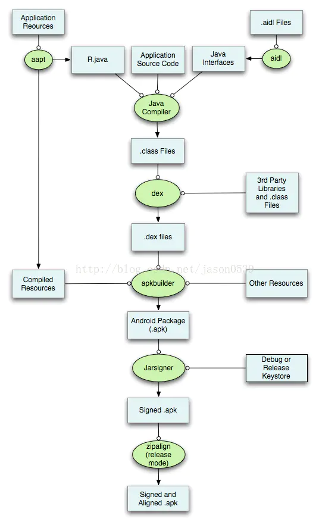

## 包体积优化

> 参考资料: https://zhuanlan.zhihu.com/p/132685824

1. AndResGuard，即7zip，主要为了混淆资源ID长度(res/drawable/welcome.png混淆为r/s/a.png)
2. 使用一套图片资源，只保留xxhdpi图片资源
3. Lint扫描删除无用资源，物理删除无用的资源文件
4. Release时开启shrinkResources(打包时移除无效资源)，开启代码混淆
5. png图片压缩
6. 使用webp图片格式
7. 纯色背景大图可使用shape代码实现
8. arsc优化,通过指定语言格式移除备用资源

```java

defaultConfig {
        ...
        resConfigs "zh", "zh-rCN"
    }

```

9. 只提供对主流架构的支持，比如arm，对于mips和x86架构可以考虑不提供支持，系统会自动提供相应的兼容。只在armeabi下面放置了一套so库文件
10. 三方库处理，尽量少的使用第三方库，必须要使用的时候，库体积需作为参考条件之一。
11. 组件化


## [apk打包流程](https://www.jianshu.com/p/d29c37dda256)



## [apk安装流程](http://www.androidchina.net/6667.html)

